# ArcPageIndicator [](https://sonarcloud.io/dashboard?id=applibgroup_ArcPageIndicator) [](https://github.com/applibgroup/ArcPageIndicator/actions/workflows/main.yml)
Bored of the usual small points or stressed by the space occupied by a tab bar?<br>
Try this elevator-like elegant and original page indicator!
A fully customizable super-easy Page Indicator, with stunning animations and very original and discreet graphics, for HarmonyOS. Needs a very small screen, perfect when many pages need to be shown and reached in a small time.
<br>


<br>


- [x] Out-of-the-box working indicator
- [x] Fully customizable and styleable
- [x] Can be programmatically controlled
- [x] Includes rather complex ellipses calculations :-)

<br>
An old elevator that inspired this project.

## Source
The code in this repository was inspired from [BeppiMenozzi/ArcPageIndicator - v1.0.2](https://github.com/BeppiMenozzi/ArcPageIndicator). 
We are very thankful to Mr. BeppiMenozzi.

### Dependency
1. For using ArcPageIndicator module in sample app, include the source code and add the below dependencies in entry/build.gradle to generate hap/support.har.
```
	dependencies {
		implementation project(':arcpageindicator')
        	implementation fileTree(dir: 'libs', include: ['*.har'])
        	testCompile 'junit:junit:4.12'
	}
```
2. For using ArcPageIndicator in separate application using har file, add the har file in the entry/libs folder and add the dependencies in entry/build.gradle file.
```
	dependencies {
		implementation fileTree(dir: 'libs', include: ['*.har'])
		testCompile 'junit:junit:4.12'
	}

```
3. For using ArcPageIndicator from a remote repository in separate application, add the below dependencies in entry/build.gradle file.
```
	dependencies {
		implementation 'dev.applibgroup:arcpageindicator:1.0.0'
		testCompile 'junit:junit:4.12'
	}
```
    
### Minimal usage
Layout for left 180° ellipse:
```xml
    <it.beppi.arcpageindicator.ArcPageIndicator
        ohos:height="120vp"
        ohos:width="60vp"
        ohos:vertical_center="true"
        ohos:align_right="$id:page_slider"
        ohos:id="$+id:arc_pi_5"
        app:pageSliderId="$id:page_slider"
        app:arcOrientation="toLeft"
        app:animationType="fill"
        app:spotsColor = "#FFFFFFFF"
        app:selectedSpotColor = "#FF000000"
        />
```
Layout for upper-right 90° ellipse:
```xml
    <it.beppi.arcpageindicator.ArcPageIndicator
        ohos:height="60vp"
        ohos:width="60vp"
        ohos:align_bottom="$id:page_slider"
        ohos:align_left="$id:page_slider"
        ohos:id="$+id:arc_pi_2"
        app:pageSliderId="$id:page_slider"
        app:arcOrientation="toUpRight"
        app:animationType="slide"
        app:spotsRadius = "18"
        app:spotsColor = "#FF3F51B5"
        app:selectedSpotColor = "#FFFF4081"
        />
```
### Attributes description
List of attributes with description:
<table>
<tr><th colspan="2">General</th></tr>
<tr><td><b>pageSliderId</b></td><td>The pageSlider Id associated to the Indicator</td></tr>
<tr><th colspan="2">Arc appearance</th></tr>
<tr><td><b>arcOrientation</b></td><td>Orientation of the "belly" of the arc. This parameter also affects if the arc will be 90° (corner arc) or 180° (edge arc)</td></tr>
<tr><th colspan="2">Spot appearance</th></tr>
<tr><td><b>spotsColor</b></td><td>Color of the spots</td></tr>
<tr><td><b>selectedSpotColor</b></td><td>Color of the selected spot</td></tr>
<tr><td><b>spotsRadius</b></td><td>Size of the spots</td></tr>
<tr><td><b>spotsShape</b></td><td>Shape of the spots: Circle, RoundedSquare or Square</td></tr>
<tr><th colspan="2">Spots distribution and movement</th></tr>
<tr><td><b>intervalMeasure</b></td><td>How spots are distributed on the circumference: constant angle or constant arc length. With constant angle, the spots will not be distributed evenly, because of ellipse's eccentricity. Normally constant arc length is used: being a non-finite math problem, here an approximation function is used, as explained later on.</td></tr>
<tr><td><b>invertDirection</b></td><td>If spots will be selected in inverted direction</td></tr>
<tr><td><b>animationType</b></td><td>See below to detailed explanation of animation types</td></tr>
<tr><th colspan="2">Hand appearance</th></tr>
<tr><td><b>handEnabled</b></td><td>If hand is drawn</td></tr>
<tr><td><b>handColor</b></td><td>Hand's color</td></tr>
<tr><td><b>handWidth</b></td><td>Hand's width</td></tr>
<tr><td><b>handRelativeLength</b></td><td>Hand's relative length starting from center to edges (1 = full length)</td></tr>
</table>

### Animation types
List of animation types:
<table>
<tr><th>Name</th><th>toBottomRight</th><th>toUp</th><th>Notes</th></tr>
<tr><td><b>Color</b></td><td>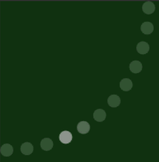</td><td></td><td><h6>Color cross-fade</h6></td></tr>
<tr><td><b>Slide</b></td><td>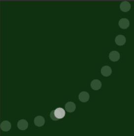</td><td></td><td><h6>Simple movement</h6></td></tr>
<tr><td><b>Pinch</b></td><td>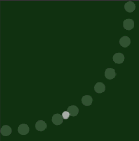</td><td></td><td><h6>Simple movement<br>with size reduction</h6></td></tr>
<tr><td><b>Bump</b></td><td>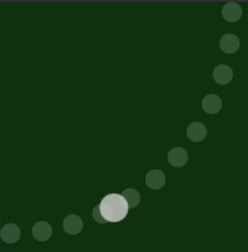</td><td></td><td><h6>Simple movement<br>with size growth.<br><i>Might need additional padding</i></h6></td></tr>
<tr><td><b>Rotate</b></td><td>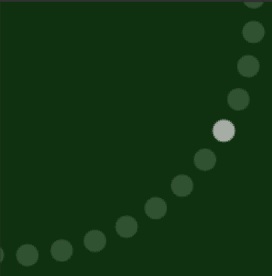</td><td></td><td><h6>Inverted movement of all spots</h6></td></tr>
<tr><td><b>Rotate Pinch</b></td><td>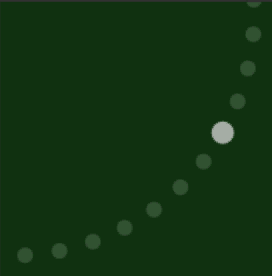</td><td></td><td><h6>Inverted movement of all spots<br>with size reduction</h6></td></tr>
<tr><td><b>Cover</b></td><td>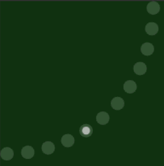</td><td></td><td><h6>Spots are filled from inside</h6></td></tr>
<tr><td><b>Fill</b></td><td>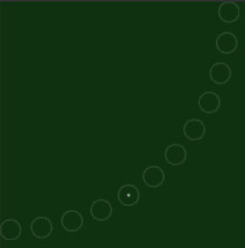</td><td></td><td><h6>Spots are empty and filled from inside</h6></td></tr>
<tr><td><b>Surround</b></td><td>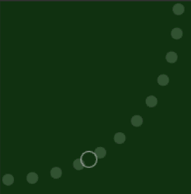</td><td></td><td><h6>Simple movement of a circle<br>surrounding smaller spots</h6></td></tr>
<tr><td><b>Necklace</b></td><td>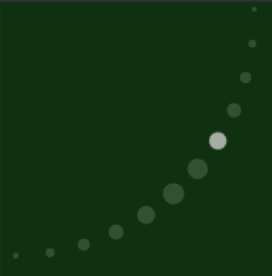</td><td></td><td><h6>Inverted movement of all spots,<br>with center spot biggest<br>and lateral spots smaller</h6></td></tr>
<tr><td><b>Necklace 2</b></td><td>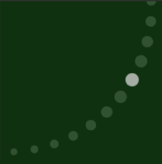</td><td></td><td><h6>Inverted movement of all spots,<br>with selected spot biggest<br>and farthest spot smallest</h6></td></tr>
</table>
<table>
<tr><td><b>Example of hand</b></td><td>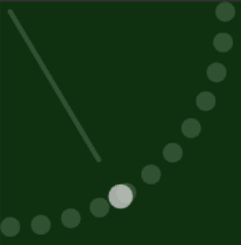</td><td></td></tr>
<tr><td><b>Example of rounded squared spots</b></td><td>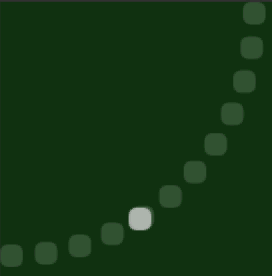</td><td></td></tr>
</table>

### Some maths
<a href="http://math.stackexchange.com/questions/2093569/points-on-an-ellipse">This question Mr. Beppi Menozzi made</a> helped him solve the
ellipse's problem. Indeed, finding arcs of constant length on a known ellipse is a problem with a non-finite solution, that needs integrals to be calculated. There were at least 5 approaches to solve this problem with acceptable performance:

* find the points recursively, by iteratively reducing the error until it's close enough to zero. Pros: easy to do. Cons: adds a indetermined (although very small) time to the drawing process
* create a big table of sampled data and storing them to provide a database of pre-calculated solutions. Pros: fastest. Cons: can't work for *any* number of elements
* distribute the points on the radius and project them on the circumference. Pros: very fast. Cons: error still pretty large
* use an approximated function. Pros: fast and good enough. Cons: never perfect
* calculate the elliptic integrals. Pros: perfect. Cons: very very very heavy on performance

He chose to find a good approximated function and that is what you can find inside the code, it's fast enough and the error is near to invisibility. In case you need more performance, you can remove the e6 part of the formula and have a slightly bigger error.

The formula used is the one of the referenced question, and thanks very much to its author, <a href="http://math.stackexchange.com/users/299599/ng-chung-tak">Ng Chung Tak</a> that is both the author of the answer, and the author of the formula itself.


Author
-------
* Beppi Menozzi
* <a href="http://math.stackexchange.com/users/299599/ng-chung-tak">Ng Chung Tak</a> formula's author


License
-------
    The MIT License (MIT)

    Copyright (c) 2016 Beppi Menozzi

    Permission is hereby granted, free of charge, to any person obtaining a copy
    of this software and associated documentation files (the "Software"), to deal
    in the Software without restriction, including without limitation the rights
    to use, copy, modify, merge, publish, distribute, sublicense, and/or sell
    copies of the Software, and to permit persons to whom the Software is
    furnished to do so, subject to the following conditions:

    The above copyright notice and this permission notice shall be included in all
    copies or substantial portions of the Software.

    THE SOFTWARE IS PROVIDED "AS IS", WITHOUT WARRANTY OF ANY KIND, EXPRESS OR
    IMPLIED, INCLUDING BUT NOT LIMITED TO THE WARRANTIES OF MERCHANTABILITY,
    FITNESS FOR A PARTICULAR PURPOSE AND NONINFRINGEMENT. IN NO EVENT SHALL THE
    AUTHORS OR COPYRIGHT HOLDERS BE LIABLE FOR ANY CLAIM, DAMAGES OR OTHER
    LIABILITY, WHETHER IN AN ACTION OF CONTRACT, TORT OR OTHERWISE, ARISING FROM,
    OUT OF OR IN CONNECTION WITH THE SOFTWARE OR THE USE OR OTHER DEALINGS IN THE
    SOFTWARE.
